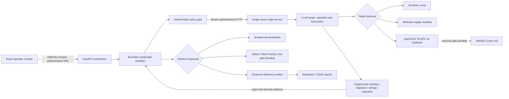

# SiliconSentinel system architecture

Updated: 2026-09-22. Inspected branch: dev. Baseline: ad823ab842526fd8ee10acc57a15c8ca39327350.
Implemented milestones: 50e2597 (edge/evidence) and 48de175 (offline workflow/dashboard).
The repository is JTAGent; SiliconSentinel is the product name. This file supersedes the original
intent-only architecture; it does not claim that main or a physical board was inspected.

## Components and data flow

The edge and orchestrator are separate FastAPI processes and communicate over the documented API.
Both can run locally. Token Factory inference does not establish Nebius compute deployment.
The browser contains no edge/provider key. There is one target-owning edge worker and one active
orchestrator audit. Do not run a competing debugger or a second edge worker against the same CPU.

## Independent modes

TARGET_BACKEND is mock, replay or openocd. INFERENCE_BACKEND is scripted or nebius.
Mock bytes are explicitly synthetic. Replay bytes come from a manifest with original capture time,
profile, provenance, addresses, SHA256 values and registers. Replay is read-only. OpenOCD attempts
actual debugger communication and never falls back to fixtures. Scripted analysis is not an LLM.

The offline path has been exercised through real loopback HTTP and a browser. OpenOCD's protocol
adapter and Nebius's HTTP adapter have fake-server tests. Neither has passed its physical/account gate.

## Typed contracts and local policy

contracts/models.py is authoritative; contracts/openapi.json and web/src/api.d.ts are generated.
Addresses are strict unsigned 32-bit integers. Ends are exclusive. Booleans, expression strings,
overflow, cross-region reads, unknown spaces and disallowed registers are rejected.
Only explicitly approved RAM/ROM regions are supported. MMIO and unknown regions are excluded.
Configuration is not memory discovery, and a profile address is not proof of relocated U-Boot.

Profiles define architecture/endian/mode, register allowlists, capabilities and provenance.
Sessions can only narrow local operations/ranges and have cumulative byte, operation and expiry limits.
Initial reads are 256 bytes; per-call maximum is configurable up to 4096. Demo runs allow at most
12 captures, 16 KiB, four analysis iterations and 120 seconds. Policy changes/arming are not model tools.

Authenticated edge routes:
- GET /api/v1/target/status and /api/v1/target/profile.
- POST /api/v1/sessions, /memory/read, /registers/read and /snapshots/capture.
- POST /api/v1/target/halt, /target/resume, /target/step and /memory/write.
- GET /healthz is unauthenticated process liveness only.

State changes never use GET. Live independent halt/step is disabled; live writes are dry-run previews
only. Mock controls have a bounded local lease. The web operator starts/cancels scoped audits;
manual control endpoints are available to authenticated local clients, not the model.

## Capture lifecycle and uncertainty

A snapshot holds the target lock across validation, optional halt, memory/register capture and
restoration. Local arming and session halt/resume permissions are required if the CPU is running.
The edge restores only a state change it owns; an initially halted CPU remains halted.
Restoration has a separate local timeout, so cloud inference is never the halt watchdog.

A transport failure can mean an action happened but its acknowledgment was lost. Such outcomes are
marked uncertain, not retried blindly, and can block subsequent operations pending local reconciliation.
Request IDs are bound to their payloads in a bounded operation ledger; conflicting reuse is rejected.
This is not an exactly-once guarantee. A process crash/power loss requires operator recovery.
Generation values describe changes observed/issued by this edge process; external debug owners and
unobserved resets are outside the contract. DMA and peripherals may still change memory while halted.

OpenOCD uses 0x1a-terminated Tcl frames, bounded partial reads, fixed templates and loopback sockets.
Notifications/traces are disabled; extra or malformed frames fail closed. Installed command syntax
and version must be reviewed before setting OPENOCD_VERSION_PREFIX. No service starts OpenOCD,
runs arbitrary Tcl/shell, resets the board or flashes firmware.

## Evidence and findings

Capstone decodes original bytes only in profile-marked executable regions; strings carry exact offsets.
Hashes are computed before redaction. Metadata includes original/replay capture time, source mode,
generation, decoder version, architecture, endian, mode and settings provenance.
Live/replay raw hex is withheld from the orchestrator. Pattern/configured-value redactions are marked;
pattern matching does not find all secrets. Approved region selection is still a data-disclosure decision.

The model interprets compact derived evidence; it is not an authoritative disassembler.
The shared module exposes a local ELF metadata utility. Full symbol resolution, stack unwinding,
U-Boot environment CRC/redundancy parsing and runtime reachability analysis remain unsupported.
Crash mode reports registers and uncertainty; it does not invent a diagnosed crash.

LangGraph stages are planner, policy gate, collector, decoder, analyst, verifier and reporter.
Follow-ups return through the policy gate. Cancellation, deadlines, byte/action/iteration limits,
invalid proposals, no new evidence and dependency failures terminate the run.
There are no durable checkpoints or graph interrupt/resume semantics in the MVP.

Firmware strings/logs are untrusted data. Only a validated read proposal can reach the collector.
Finding reference checks are not proof of semantic correctness. Exact string observations receive a
normalized title/info severity. Other plausible claims remain suspected/inconclusive; invalid references
are rejected. No automatic path promotes a hypothesis into a validated vulnerability.

Statuses: observed = exact evidence fact; suspected = unverified hypothesis; validated = independently
established (not assigned by this MVP); inconclusive = insufficient evidence; rejected = invalid support.
Severity and confidence are independent. A shell string does not establish root access.

## Trust boundaries and retention

Browser to orchestrator: password login, random expiring HttpOnly SameSite cookie, same-origin requests,
authenticated SSE, Origin checks for mutations, login throttling and bounded request bodies.
Deployment requires HTTPS, COOKIE_SECURE=1 and a correct PUBLIC_ORIGIN.
Orchestrator to edge: server-held bearer key. A tunnel does not replace edge authentication or local policy.
Orchestrator to provider: server-held credential, explicit HTTPS endpoint/model and verified hosted limits.

Raw live bytes are short-lived edge function data, never checkpoints or ordinary logs.
Orchestrator runs are in memory, limited to 20, deleted through the UI/API or expired after one hour.
The edge's bounded 1024-entry sanitized operation ledger lasts until restart. Exported files are
operator-managed and are not removed when a run is deleted. Mock fixtures remain in source control.
Tracing is disabled by the orchestrator entrypoint; no external analytics or database is configured.
Provider retention is unknown until the account settings are checked. No database is not zero retention.
Intentional live raw-capture export is deferred; replay manifests must come from a trusted local procedure.

See docs/live-integration.md for source links and exact live gates, docs/demo.md for the demonstration,
and docs/milestones.md for test evidence and measured offline performance.
